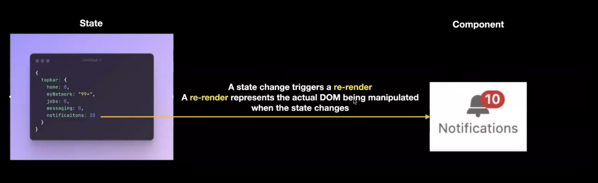
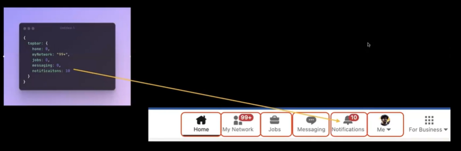

### React Foundation.

Static website - The website which content will not change based on the page load.

For dynamic website the libraries like react helps to do DOM manipulation.

Say for the counter button the click on the counter will increase the count.

```js
function onButtonPress() {
  const currValue = document.getElementById("btn").innerHTML;
  console.log(currValue.split(" "));
  const currCounter = currValue.split(" ")[1];
  const newCounter = parseInt(currCOunter) + 1;
  document.getElementById("btn").innerHTML = "Counter " + newCounter;
}
```

In react we need to focus on 3 things. Components, State and Rerendering.



One notification bell and the big object which has all the value that will change. When the value change react takes care of the DOM. There will be componenet where all teh element will be structured together. One another section which will tell the connection between the state and the component.

The state will update when the backend will say like the notification count is increased.
React will re render and give the update to the component.


**Counter one in state and component form.**

```js
<script>
let state = {
    count:0
}
function onButtonPress(){
    state.count++;
    buttonComponentRerender()
}

function buttonComponentRerender(){

    document.getElementById("buttonParent").innerHTML = "";
    const button = document.createElement("buttin");
    button.innerHTML = `Counter ${state.count}`;
    button.setAttribute("onclick",`onButtonPress()`);
    document.getElementById("buttonParent").appendChild(button);
}

buttonComponentRerender();
</script>
```

```js
<script>
let state = {
    count:0
    // State variable on top. Object on top.
}

function onButtonPress(){
    state.count++;
    buttonComponentReRender();
}
function buttonComponentReRender(){
    document.getElementById("buttonParent").innerHTML = "";
    const component = buttonComponent(state.count);
    document.getElementById("buttonParent").appendChild(component);
    // We can create multiple element only will get in the dom after we use it with other element and then use the appendChild.
}
function buttonComponent(count){
    const button = document.createElement("button");
    button.innerHTML = `Counter ${count}`;
    button.setAttribute("onclick",`onButtonPress()`);
    return button;
}
buttonComponentReRender();
</script>
```

One state given how the component will respond is written inside the component.

It is written inside `buttonComponent` function.

`buttonComponent` and `onButtonPress` is defining the button components.

State is given to the component and it gives the output of how the html will look like the button or any other div.

One time we have to write the entire thing later we kust need to change `onButtonPress` update the state and rerender.

We need to write the state and the component and the function to update the global state.

Using react we donot need the rerender method as it is there in React.

```js
import React from "react";

function App() {
  const [count, setCount] = React.useState(0);
  // way to define state in react.
  // We need to write like this so that react always check the state and update the count.
  // arr[1,3] -> arr[0], arr[1]
  // const [a,b] = arr;
  // const [a,b] = [1,2]
  // array destructuring
  // const {name} = {name:"sdeb",age:20}
  // object destructuring - given an object we are only getting the name.

  return (
    <div>
      <Button count={count} setCount={setCount}></Button>
    </div>
  );
}

function Button(props) {
  function onButtonClick() {
    props.setCount(props.count + 1);
  }
  return <button onClick={onCuttonClick}>Counter {props.count}</button>;
}

export default App;
```

Terminal -> folder -> `npm create vite@latest` -> give a name to the project -> select react and then js.

A react app will be created inside the folder.
We can have multiple react project inside the folder.

Inside the src there is index.html and there we have jsx and id="root" jsx is a type of file where we can add js and xml.

```html
<body>
  <div id="root"></div>
  <script type="module" src="/src/main.jsx"></script>
</body>
```

In main.jsx we have the root.

```js
ReactDOM.createRoot(document.getElementById("root")).render(<App />);
```

Here we will take the root element and render the <App/>.

In the App.js we have a component.

As of now just the component.

```js
import "./App.css";

function App() {
  return <>hi there.</>;
}

export default App;
```

In the terminal `npm i` and `npm run dev`. It will open in `http://localhost:5173/`.

### How the index.html and main.jsx and app.jsx and the react is making to html css and js.

In terminal if we run `npm run build` we will get the dist folder. The dist will contain the html and js.

In the dist folder if we click on the index we will get the same output.

### Converting the recat to a dynamic page.

```js
let state = {
  count: 0,
};
function App() {
  return (
    <div>
      <button>Counter : {state.count}</button>
    </div>
  );
}

export default App;
```

This will show the counter and will not update.

We need to call the function.

```js
let state = {
  count: 0,
};
function App() {
  function onClickHandler() {
    alert("Hi there");
  }
  // This function will be called.
  return (
    <div>
      <button onClick={onClickHandler}>Counter : {state.count}</button>
    </div>
    // We just need to call the function with out ().
  );
}
```

`function onClickHandler() {
state.count++;
// alert("Hi there");
}`
react will look into the changes and update.

In this case the state value will update but the component will not rerender as for rerendering we need to make the state in a specific form. React will watch it and change it.

`import {useState} from 'react';`

Here we are just making the count as a global variable.

```js
const [count, setCount] = useState(0); // Here [1,2] means count will get 1 and setCount will get 2.
function onClickHandler() {
  // state.count++;
  // here we donot have the global state and count.
  // count++;
  // We can do this but not correct.
  setCount(count + 1);
}
```

We cannot usestate.count as it is not a global variable.

```js
function App() {
  const [count, setCount] = useState(0);
  // Defining the initial state.
  function onClickHandler() {
    setCount(count + 1);
  }
  return (
    <div>
      <button onClick={onClickHandler}>Counter : {count}</button>
    </div>
  );
}
```

https://youtu.be/OTNe0eV8418?si=7tUdk1bXFfdmNnDB

Link.

We can create some components in a separate function as it is more scalable.

```js
function App() {
  const [count, setCount] = useState(0);

  return (
    <div>
      <CustomButton count={count} setCount={setCount}></CustomButton>
      <CustomButton count={count} setCount={setCount}></CustomButton>
      <CustomButton count={count} setCount={setCount}></CustomButton>
    </div>
    // We can reuse the component.
  );
}
//component
function CustomButton(props) {
  // Takes state as a input.
  // We can destructure the function.
  function onClickHandler() {
    props.setCount(props.count + 1);
    //setCount is also recieved inside the props.
  }
  return <button onClick={onClickHandler}>Counter {props.count}</button>;
}
```

The code is converted to `document.createElement`

### TODO application.

State of the application.

```js
todo{
    todos:[{title:"todo1",decription:"First Todo",completed:false}]
}
```

The new react app is created inside the react project folder.

```js
const [todos, setTodos] = useState([
  {
    title: "Workout",
    description: "From 7 - 9.",
    completed: false,
  },
  {
    title: "Study",
    description: "From 7 - 11.",
    completed: false,
  },
]);
```

We can directly put the element inside the div. It is an array so we need to first converted to string.

```js
return <div>{JSON.stringify(todos)}</div>;
```

We will get the output of todos.
To get the element will just get the single todos.

```js
function Todo(props) {
  return (
    <div>
      <h1>{props.title}</h1>
      <h1>{props.description}</h1>
      <h1>{props.completed}</h1>
    </div>
  );
}
```

Now we can use it.

```js
return (
  <div>
    <Todo title="SDEB" description="Checking." />
  </div>
);
```

We can pass the variable like todos[0].title.

```js
return (
  <div>
    <Todo title={title[0].title} decription={todo[0].description} />
  </div>
);
```

Now we have todo this multiple times so will use loops.

```js
return (
    <div>
    {todos.map(function(todo){
        return <Todo title = {todo.title} decription={todo.description}>
    })}
    </div>
)
```

### Adding one button and that will show the todos.

```js
function App(){
    //State.
    function addTodo(){
        setTodos[...todos,{
            title:"New Todo",
            descripon:"Description of New Todo.
        }]
    }
    // [...todods] - here it splits the element. It is not related with setTodos.
    // [...todos,3] = [1,2,3] Means it add 3 to the data.
    // It has the original data and then add 3 at the end.

    return (
        <div>
            bolean oClick={addTodo} -> Add a random todo.
        </div>
    )
}
```

> Some of the open source for js cal.com, p5-js-web-editor.
> p5 is a replit like editor.

When we make another dummy component like <DummyComponent> and do just simply console.log() without any props and call it from the main it will rerender.

In react if parent call gets rerender then all child class gets rerender.

```js
function addTodo(){
        setTodos[...todos,{
            title:"New Todo",
            descripon:"Description of New Todo.
        }]
    }
```

We have the todos and when we click on the addTodo the new one gets added.

We can also do it in this way.

```js
function addToso() {
  let newTodos = [];
  for (let i = 0; i < todos.length; i++) {
    newTodos.push(todos[i]);
  }
  newTodos.push({
    title: "new Todo Added",
    description: "Description of New Todo.",
  });
  setTodos(newTodos);
}
```

We call the setTodos as it has all the original Todos and the newTodos.
It will update te todos and then in the return it will update the new set of Todos in the DOM.

Making one component.

```js
function APP() {
  return (
    <div>
      <DarkNewTodos todos={todos} />
    </div>
  );
}

function DarkNewTodos(props) {
  return (
    <div>
      {props.todos.map(function (todo) {
        return (
          <div style={{ background: "black", color: "white" }}>
            <Todo title={todo.title} decription={todo.description} />
          </div>
        );
      })}
    </div>
  );
}
```

```js
<Todo count={count} />;
// passing count as parameter.
function Todo(props) {}
// Getting props as an argument.
```

We can make the state using const[].

const a=[1,2];
I can update the array and add element.
a[0]=98;

Here the array address is constant I can change the value.
